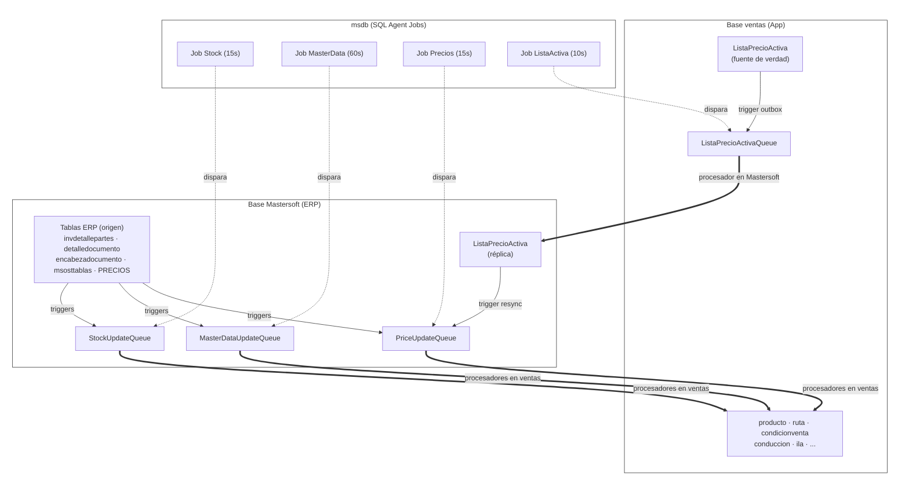
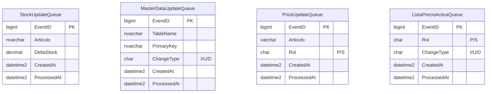
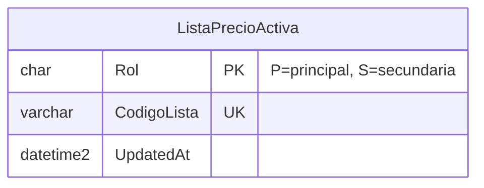
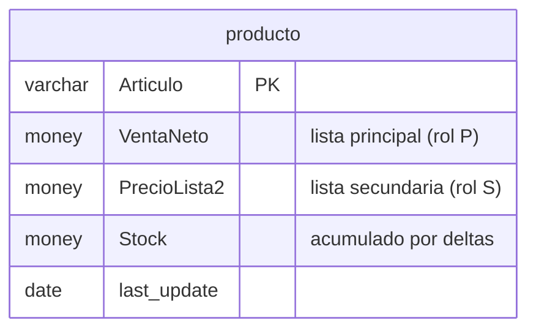
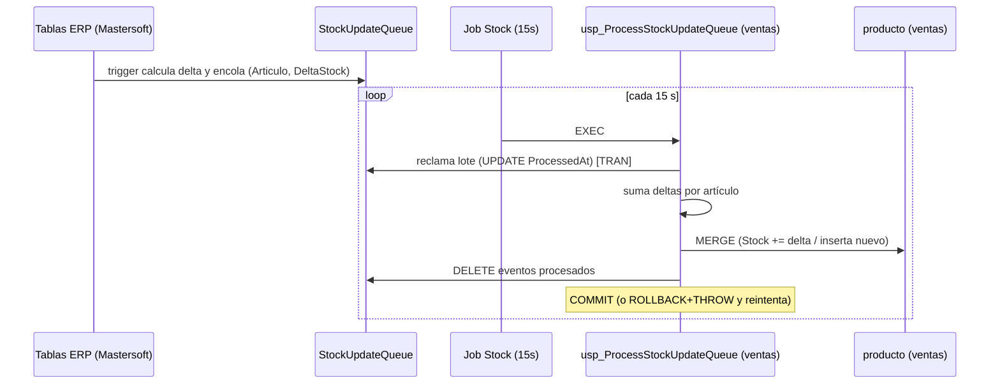
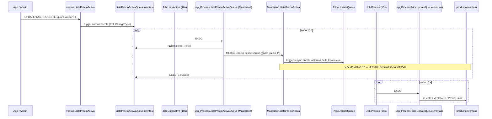
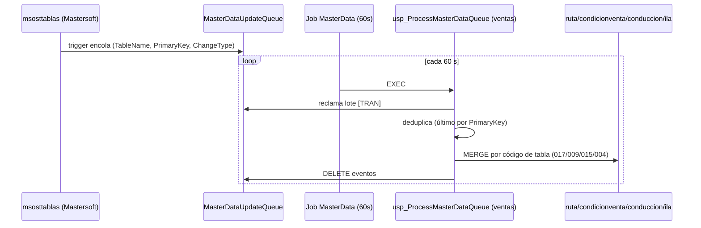

# Sincronización Mastersoft ↔ ventas (Dipalza) — Documento de diseño

> Sistema de integración asíncrona entre la base del ERP (**Mastersoft**) y la base de la aplicación Dipalza (**ventas**), basado en colas (patrón *outbox*), triggers, procedimientos almacenados y jobs del SQL Server Agent.

---

## 1. Resumen

El objetivo es mantener sincronizadas, de forma **desacoplada y asíncrona**, ciertas entidades entre el ERP y la app:

- **Stock** de productos (Mastersoft → ventas).
- **Tablas maestras**: rutas, condiciones de venta, conducción, ILA (Mastersoft → ventas).
- **Precios** de productos (Mastersoft → ventas), con dos listas activas (principal y secundaria).
- **Configuración de listas activas** (ventas → Mastersoft): la app decide qué listas están activas y eso se propaga al ERP.

El principio común a todos los flujos: **nadie consulta la otra base en línea**. Cada cambio se deja como un evento en una **cola** (outbox) en la base de origen; un **job** periódico ejecuta un **procesador** que lee la cola y aplica los cambios en la base destino. Esto evita acoplamiento, tolera caídas y permite reintentos.

---

## 2. Arquitectura general

Tres bases participan, todas en la **misma instancia** de SQL Server:

- **Mastersoft** — base del ERP. Contiene las tablas operacionales/maestras de origen y, además, las **colas**, la **configuración de listas** y los **triggers** que detectan cambios.
- **ventas** — base de la app Dipalza. Contiene el esquema de la aplicación y los **procedimientos** que consumen las colas.
- **msdb** — donde viven los **jobs** del Agent.

Como todas las bases están en la misma instancia, las transacciones que cruzan bases son **transacciones locales** y **no requieren MSDTC**.



**Regla de ubicación:** las **colas y triggers** viven en la base de **origen** del dato; el **procesador** vive en la base **destino** (donde escribe) y lee la cola por cross-database.

---

## 3. Modelos de datos

### 3.1 Colas (outbox)

Las cuatro colas comparten el mismo esqueleto: un `EventID` autoincremental, los datos del evento, `CreatedAt` y `ProcessedAt` (marca de "reclamado").



| Cola | Base | Qué encola | Llave del evento |
|------|------|------------|------------------|
| `StockUpdateQueue` | Mastersoft | **Delta** de stock por artículo | `Articulo` + `DeltaStock` |
| `MasterDataUpdateQueue` | Mastersoft | Cambio en tabla maestra | `TableName` + `PrimaryKey` + `ChangeType` |
| `PriceUpdateQueue` | Mastersoft | "Recalcular precio" de un artículo/rol | `Articulo` + `Rol` |
| `ListaPrecioActivaQueue` | ventas | "Re-sincronizar listas activas" | `Rol` + `ChangeType` |

### 3.2 Configuración de listas activas

`ListaPrecioActiva` existe en **ambas** bases con idéntica estructura. La de **ventas** es la fuente de verdad (la edita la app); la de **Mastersoft** es una réplica que escribe únicamente el procesador inverso.



Reglas de negocio garantizadas:

- **A lo más dos** listas activas y **una por rol** → `PRIMARY KEY (Rol)` + `CHECK (Rol IN ('P','S'))`.
- Una lista no puede cumplir ambos roles → `UNIQUE (CodigoLista)`.
- **Al menos una** (siempre debe existir la principal `'P'`) → no es expresable como CHECK estático, se hace con un **trigger guard**.

El **rol** define a qué campo de `producto` va el precio:

- `'P'` (principal) → `producto.VentaNeto`
- `'S'` (secundaria) → `producto.PrecioLista2`

### 3.3 Tabla destino de precios y stock: `producto` (ventas)

Columnas relevantes para la sincronización:



### 3.4 Tabla fuente de precios: `PRECIOS` (Mastersoft)

Tabla del ERP (no se crea en el script; ya existe). Columnas clave usadas:

- `Articulo` `varchar(15)` — código de artículo.
- `CodigoLista` `varchar(3)` — a qué lista pertenece el precio.
- `VentaNeto` `money` — **es la columna de precio** que alimenta a `producto`.

> En la práctica `(Articulo, CodigoLista)` es **único**. Como `PRECIOS` no tiene columna de identidad ni de fecha, ante un eventual duplicado se colapsa con `MIN(VentaNeto)` de forma determinista (el "orden de inserción" no es recuperable en un heap).

---

## 4. Decisiones de diseño

### 4.1 Patrón outbox + procesador (común a todo)

- Cada cambio se registra como **evento en una cola**, no se aplica en línea. Desacopla ERP y app y tolera indisponibilidad temporal de cualquiera de los lados.
- El procesador usa un **patrón de "claim"**: toma un lote (`TOP (@batchSize)`), lo marca con `ProcessedAt` mediante `UPDATE ... OUTPUT`, lo aplica, y al final **borra físicamente** los eventos procesados.

### 4.2 Transaccionalidad (corrección aplicada a los 3 procesadores)

Originalmente, el marcado de `ProcessedAt` se confirmaba por su cuenta; si luego fallaba la aplicación o la limpieza, los eventos quedaban marcados **pero sin aplicar** → se perdían.

**Corrección:** se envuelve `claim + aplicar + limpiar` en **una sola transacción** con:

- `SET XACT_ABORT ON` — cualquier error de runtime aborta la transacción.
- `BEGIN TRY ... BEGIN TRAN ... COMMIT ... END TRY`
- `BEGIN CATCH ... ROLLBACK ... THROW ... END CATCH` — el `ROLLBACK` deshace también el claim, los eventos vuelven a `ProcessedAt = NULL` y se reintentan en el siguiente ciclo. Como el recálculo es **idempotente**, reintentar es seguro. El `THROW` hace que el step del job falle y quede registrado.

### 4.3 Stock — acumulación de deltas

- Los triggers sobre las tablas de movimiento calculan un **delta** (`+`/`-`) por artículo, considerando `inserted`/`deleted` para cubrir insert/update/delete, la `vigencia` de documentos y el local `'000'`.
- El procesador **suma** los deltas del lote por artículo y hace `MERGE` sobre `producto` (suma al `Stock`; si el artículo no existe y hay datos maestros en `ARTICULO`, lo inserta).

### 4.4 Tablas maestras — eventos I/U/D

- El trigger encola `TableName|PrimaryKey` con `ChangeType`.
- El procesador **deduplica** (último evento por `PrimaryKey`) y aplica `MERGE` al destino según el código de tabla: `017`→`ruta`, `009`→`condicionventa`, `015`→`conduccion`, `004`→`ila`.

### 4.5 Precios — recálculo idempotente, no deltas

- La cola lleva **`(Articulo, Rol)`**, no el precio ni un delta. El evento solo dice *"recalcula el precio de este artículo para este rol"*; el procesador resuelve el valor leyendo la **lista activa actual** y `PRECIOS` al momento de procesar. Esto lo hace idempotente y coherente aunque la lista activa cambie entre encolar y procesar.
- **Eliminación de ruido en el trigger:** con `EXCEPT` sobre `(Articulo, CodigoLista, VentaNeto)` solo se encola cuando el precio o la lista realmente cambian; ediciones a otras columnas no generan eventos. En `UPDATE` solo se encola el **lado nuevo** (`inserted`); el lado viejo sería un no-op.
- **"No encontrado → 0":** si al recalcular el artículo ya no tiene precio en la lista activa (p. ej. se borró), el campo queda en **0**. Esto es seguro **porque el resync solo encola artículos que sí están en la lista nueva** (ver 4.6); los que no coinciden nunca se encolan y conservan su precio.
- **Pivot a una fila por artículo** en el procesador: evita el bug de `UPDATE ... FROM` con múltiples filas origen (si un artículo trae evento `'P'` y `'S'`, sin pivot solo se aplicaría uno). Las banderas `hasP`/`hasS` distinguen "hay evento y precio" → ponerlo, "hay evento sin precio" → 0, "no hay evento" → dejar el campo intacto.
- **No se insertan productos nuevos** desde eventos de precio (`producto` lo crea el flujo de stock, que aporta las columnas obligatorias).

### 4.6 Resync al cambiar la lista activa

El trigger sobre `Mastersoft.ListaPrecioActiva`:

- **Activar o cambiar** una lista (INSERT / UPDATE de `CodigoLista`) → re-encola en `PriceUpdateQueue` **todos los artículos de la lista nueva** para ese rol. Los que no están en la lista nueva no se encolan → **conservan su precio actual**.
- **Desactivar la secundaria `'S'`** (DELETE) → `UPDATE` masivo **directo** que pone `producto.PrecioLista2 = 0` para todos. Es la única operación de "poner a 0", uniforme, por lo que se hace directo (cruzando a `ventas`) en vez de pasar por la cola.

### 4.7 Guard "al menos una principal"

Trigger sobre `ListaPrecioActiva` que, tras cualquier operación, exige que exista la fila `'P'`; si no, `ROLLBACK` + `THROW`. Consecuencias: no se puede activar `'S'` antes que `'P'`, no se puede borrar `'P'`, y para cambiar la principal se hace `UPDATE` de su `CodigoLista` (no borrar+insertar). El `ROLLBACK` es atómico, por lo que el guard y el resync conviven como dos triggers `AFTER` sin importar el orden.

### 4.8 Sincronización inversa (ventas → Mastersoft)

La app decide las listas activas. La fuente de verdad pasa a ser **`ventas.ListaPrecioActiva`**; la de Mastersoft es una **réplica**. Se usa el mismo patrón outbox en sentido inverso, y el procesador hace una **sincronización espejo completa** (la tabla es de ≤2 filas, así que sincronizar todo es trivial y robusto: evita estados intermedios sin `'P'` que dispararían el guard). Al escribir en `Mastersoft.ListaPrecioActiva` se **reusan los triggers existentes** (resync + guard) → se re-cotizan los productos automáticamente.

### 4.9 Transacciones cross-database

Todos los procesadores y el resync cruzan bases (`ventas` ↔ `Mastersoft`). Al estar en la **misma instancia**, son transacciones **locales**; no se requiere MSDTC. Solo lo necesitarían si las bases estuvieran en servidores distintos vía linked server.

---

## 5. Flujos de datos

### 5.1 Flujo de stock



### 5.2 Flujo de precios (cambio en `PRECIOS`)

```mermaid
sequenceDiagram
    participant PR as PRECIOS (Mastersoft)
    participant LPA as ListaPrecioActiva
    participant Q as PriceUpdateQueue
    participant Job as Job Precios (15s)
    participant P as usp_ProcessPriceUpdateQueue (ventas)
    participant Prod as producto (ventas)

    PR->>LPA: trigger comprueba si la lista está activa
    PR->>Q: si activa y cambió VentaNeto/Codigo, encola (Articulo, Rol)
    loop cada 15 s
        Job->>P: EXEC
        P->>Q: reclama lote [TRAN]
        P->>LPA: resuelve lista activa por rol
        P->>PR: lee VentaNeto del artículo en esa lista (o NULL)
        P->>Prod: UPDATE VentaNeto (rol P) / PrecioLista2 (rol S); NULL→0
        P->>Q: DELETE eventos
        Note over P: COMMIT (o ROLLBACK+THROW)
    end
```

### 5.3 Flujo de cambio de lista activa (cascada completa, ventas → Mastersoft → precios)

Es el flujo más completo: combina la sincronización inversa con el resync de precios.



### 5.4 Flujo de tablas maestras



---

## 6. Pasos de instalación

`db/install_dipalza_sync.sql` es la **única fuente de verdad**: se ejecuta de punta a punta y está dividido en secciones, cada una con su `USE <base>` y separadores `GO`. Collation del esquema: `Modern_Spanish_CI_AS`.

Los fragmentos originales desde los que se consolidó (`actualiza_stock.sql`, `tablas_maestras.sql`, `actualiza_precios.sql`, `modulo_precios_dipalza.sql`, `create_jobs.sql`, `users.sql`, las migraciones sueltas y la copia duplicada del propio script con otro collation) quedaron archivados en `base_de_datos/archive/` como referencia histórica; no deben volver a ejecutarse ni mantenerse en paralelo.

**Prerrequisitos**

- Las bases `Mastersoft` y `ventas` ya existen.
- En `Mastersoft` ya existen las tablas del ERP a las que se enganchan los triggers (`invdetallepartes`, `detalledocumento`, `encabezadocumento`, `msosttablas`, `PRECIOS`) y las que leen los procesadores (`ARTICULO`, `articulosnumerados`).
- SQL Server Agent activo.

**Orden de ejecución**

1. **Esquema de `ventas`** — todas las tablas de la app (incluida `PrecioLista2` dentro de `producto`) + datos semilla (roles).
2. **Objetos en `Mastersoft`** — colas, `ListaPrecioActiva`, índices y todos los triggers.
3. **Procedimientos en `ventas`** — los tres procesadores, con transacción.
4. **Jobs en `msdb`** — Stock (15s), MasterData (60s), Precios (15s).
5. **Configuración inicial y verificación.**

**Configuración inicial obligatoria** (sin esto, el sistema de precios no hace nada):

```sql
USE ventas;  -- (fuente de verdad; se propaga a Mastersoft por el job de 10s)
INSERT INTO dbo.ListaPrecioActiva (Rol, CodigoLista) VALUES ('P', '<codigo>');   -- principal
-- INSERT INTO dbo.ListaPrecioActiva (Rol, CodigoLista) VALUES ('S', '<codigo>'); -- secundaria (opcional)
```

**Notas**

- El script asume bases **limpias**: los `CREATE TABLE` no son idempotentes. Procedimientos, triggers y jobs sí se pueden re-ejecutar (`CREATE OR ALTER` y guardas de borrado en jobs).
- Correcciones respecto a los documentos originales: transacciones en los procesadores; se quitó `CREATE SCHEMA dbo;`; índices normalizados; índice geográfico como `SPATIAL`; `PrecioLista2` dentro del `CREATE`.

---

## 7. Operación: cómo funciona todo

- **Periodicidad (jobs):** Stock 15 s, Precios 15 s, ListaActiva 10 s, MasterData 60 s. A mayor frecuencia, menor latencia de propagación.
- **Lotes:** los procesadores trabajan en lotes (`@batchSize` 500/100). Un resync grande (al cambiar una lista activa) puede tardar varias corridas en propagarse; subir el `@batchSize` lo acelera.
- **Idempotencia y reintentos:** ante error, la transacción hace `ROLLBACK` (deshace el claim) y `THROW`; el job marca fallo y el siguiente ciclo reintenta. Recalcular es seguro porque los procesadores leen el estado actual.
- **Encadenamiento:** cambiar una lista activa en la app dispara una cascada automática (sección 5.3) que termina re-cotizando `producto`, sin intervención manual.

---

## 8. Estado de implementación

| Módulo | Estado |
|--------|--------|
| Esquema de `ventas` | ✅ En el script |
| Sincronización de **stock** (cola, triggers, procesador, job) | ✅ En el script |
| Sincronización de **tablas maestras** | ✅ En el script |
| Sincronización de **precios** (cola, trigger PRECIOS, resync, guard, procesador, job) | ✅ En el script |
| `ventas.ListaPrecioActiva` (tabla fuente) | ✅ En el script |
| Sincronización **inversa** (cola en ventas, trigger outbox, guard en ventas, procesador en Mastersoft, job 10s) | ✅ En el script |
| `stockVentas`/`piezasVentas` (`tgr_ventadetalle_producto`, exclusivo de la app, no afecta el stock ERP) | ✅ En el script (agregado 2026-06-29 — ver sección 9.2) |

> La sincronización inversa (sección 4.8 / 5.3) está implementada en `db/install_dipalza_sync.sql`: la cola `ListaPrecioActivaQueue` y los triggers `trg_listaprecioactiva_outbox` / `trg_listaprecioactiva_guard` viven en `ventas` (sección 1 del script); el procesador `usp_ProcessListaPrecioActivaQueue` vive en `Mastersoft` (sección 2); el job `Dipalza - Procesar ListaPrecioActivaQueue` corre cada 10 s (sección 4).

---

## 9. Inventario de triggers (estado real en BD, verificado y corregido 2026-06-29)

Consulta de referencia: `SELECT name, OBJECT_NAME(parent_id), is_disabled FROM sys.triggers`.

### 9.1 Mastersoft

| Trigger | Tabla | ¿En `install_dipalza_sync.sql`? | Qué hace |
|---|---|---|---|
| `trg_precios_priceupdate` | `PRECIOS` | ✅ Sí | Encola en `PriceUpdateQueue` el `Rol` (P/S) afectado cuando cambia el precio de un artículo en una lista activa. |
| `trg_listaprecioactiva_guard` | `ListaPrecioActiva` (réplica) | ✅ Sí | Garantiza que siempre exista una lista `Rol='P'`; si no, `ROLLBACK` + `THROW 50001`. |
| `trg_listaprecioactiva_resync` | `ListaPrecioActiva` (réplica) | ✅ Sí | Al cambiar/activar una lista, reencola sus artículos en `PriceUpdateQueue`; al desactivar `'S'`, pone `PrecioLista2=0` en todo `ventas.producto`. |
| `trg_msosttablas_sync` | `msosttablas` | ✅ Sí | Outbox genérico de tablas maestras → `MasterDataUpdateQueue`. |
| `trg_detalledocumento_stockresumen` | `DETALLEDOCUMENTO` | ✅ Sí | AFTER INSERT/UPDATE/DELETE. Si `local='000'` y la factura está vigente, calcula el delta de stock (tipoid `09`=compra suma, `06`/`10`=venta/factura resta) y lo encola en `StockUpdateQueue`. Es la fuente real de la sincronización de `producto.Stock` (ERP) al facturar — separada de `stockVentas`/`piezasVentas`, que son manejados por la app. |
| `trg_encabezadocumento_stockresumen_vigente` | `ENCABEZADOCUMENTO` | ✅ Sí | AFTER UPDATE, solo si cambia `vigente`. Aplica o revierte el delta de stock de todos los detalles del documento (anular/reactivar una factura ajusta el stock en sentido contrario). |
| `trg_invdetallepartes_stockresumen` | `invdetallepartes` | ✅ Sí | Mismo patrón de cola `StockUpdateQueue`, para movimientos de partes/inventario (`Tipoid 17` suma, `18` resta). |

*(Corrección sobre una versión anterior de esta tabla: estos 3 triggers de stock SÍ estaban ya versionados en `install_dipalza_sync.sql` — sección "Triggers de STOCK" — la nota previa que decía lo contrario era un error de revisión.)*

### 9.2 ventas

| Trigger | Tabla | ¿En `install_dipalza_sync.sql`? | Qué hace |
|---|---|---|---|
| `trg_listaprecioactiva_guard` | `ListaPrecioActiva` (fuente) | ✅ Sí | Mismo guard que en Mastersoft, aplicado en la tabla fuente. |
| `trg_listaprecioactiva_outbox` | `ListaPrecioActiva` (fuente) | ✅ Sí | Outbox de la sincronización inversa → `ListaPrecioActivaQueue`. |
| `tgr_ventadetalle_producto` | `venta_detalle` | ✅ Sí (agregado 2026-06-29) | AFTER INSERT/UPDATE/DELETE. Mientras la venta no esté `CLOSED`, **suma** `cantidad`/`piezas` a `producto.stockVentas`/`piezasVentas` al insertar un detalle (reserva el stock pendiente de facturar) y los resta si el detalle se elimina (p.ej. el vendedor borra la venta mientras la construye). Es el contrapeso del descuento que hacen los `VentaItemProcessor` al facturar (ver hallazgo del punto 4 de este chat: el neto de crear+facturar una venta vuelve al valor base). |
| `trg_ActualizarPosicionGeo` | `posicion` | ❌ No aplica (no es parte de esta sincronización) | Recalcula la columna `GEOGRAPHY` desde lat/lon al insertar/actualizar. Utilitario de geolocalización de vendedores, sin relación con Mastersoft. |
| `trg_ActualizarHistorialPosicionGeo` | `historial_posicion` | ❌ No aplica (no es parte de esta sincronización) | Mismo propósito que el anterior, sobre el histórico de posiciones. |

#### Modelo de estados de `Venta`: solo OPENED / FINISHED / CLOSED (no existe "cancelar")

En la práctica el ciclo de vida de una venta es: `OPENED` (el vendedor la está construyendo) → `FINISHED` (la cierra) → `CLOSED` (ya facturada, inmutable). No hay un estado "cancelado": si el vendedor no quiere continuar mientras construye la venta, simplemente la **elimina** (`DELETE /api/ventas/{id}` desde Flutter), lo que dispara la rama `DELETE` de `tgr_ventadetalle_producto` y libera `stockVentas`/`piezasVentas` correctamente (verificado empíricamente contra 192.168.100.102, dentro de transacción con rollback).

Durante esta sesión existió temporalmente un cuarto estado `CANCELED` (heredado de un diseño anterior) y un trigger asociado `trg_venta_restablece_stock_al_cerrar` que se descubrió roto (comparaba contra el literal `'CERRADA'`, que nunca coincidía con nada; además tenía el signo invertido) y se corrigió. Al aclarar que el modelo real de negocio es de solo 3 estados, `CANCELED` se eliminó del enum Java (`EstadoVenta`) y de Flutter (que además tenía un cuarto estado distinto, `REOPENED`, también eliminado — no era usado por el backend) y el trigger `trg_venta_restablece_stock_al_cerrar` se **eliminó** de la BD real y de `install_dipalza_sync.sql` (ya no tiene transición que cubrir; `tgr_ventadetalle_producto` por sí solo cubre tanto la reserva al crear como la liberación al eliminar).

Como parte de este ajuste se agregó además una validación que no existía: `VentaService.eliminarVenta()`/`eliminarItemVenta()` ahora **rechazan** (409 Conflict) el borrado de una venta en estado `CLOSED` — antes se podía borrar sin restricción, lo que habría dejado una factura real en Mastersoft sin ninguna venta local que la respalde.

**Conclusión:** los triggers de sincronización de **precios**, **listas activas**, **tablas maestras** y **stock ERP** estaban completos en `install_dipalza_sync.sql`. El de **`stockVentas`/`piezasVentas`** (`tgr_ventadetalle_producto`, exclusivo de la app, separado del stock ERP) no estaba versionado y quedó agregado en esta sesión, cubriendo tanto la reserva al vender como la liberación al eliminar.
